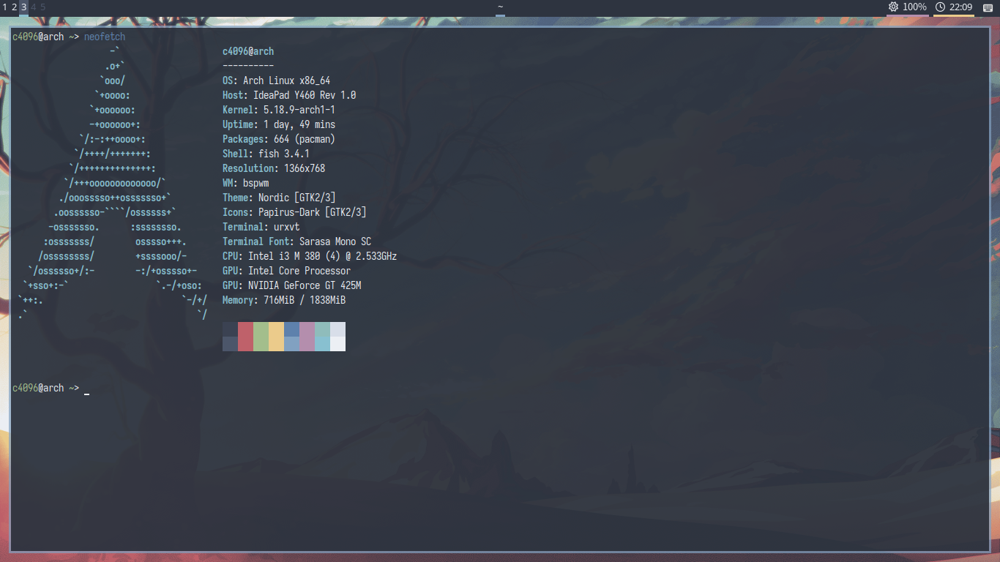

# polybar-nord-config

### About
### Modules
It only has a few of simple modules, such as workspaces, window title and brightness. All modules are shown in the screenshot above.    
If you like, you can add your own modules by yourself.
### How To Use
#### Install Font Awesome
Arch Linux: `sudo pacman -S ttf-font-awesome`   
Debian / Ubuntu: `sudo apt install fonts-font-awesome`    
Fedora / CentOS: `sudo dnf install fontawesome-fonts`   
#### Download Config
By `git clone`:   
```shell
git clone https://github.com/c4096git/polybar-nord-config ~/.config/polybar/
```    
Or you can only download `config.ini` and copy it to `~/.config/polybar`.
#### Start Polybar
Run `polybar main` or `polybar` in terminal.
